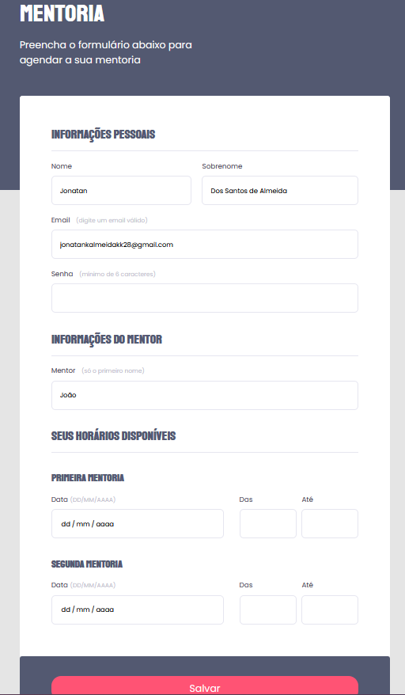

# Desafio: Criando formulários

Projeto construído a partir do Programa Explorer / Stage 03 / Criando formulários.  
Foi disponibilizado um link no <strong>Figma</strong> onde nosso objetivo era replicar o projeto, utilizando os métodos aprendidos nas aulas sobre criação de formularios.
 

Link do desafio:  https://efficient-sloth-d85.notion.site/Criando-formul-rios-462826c68ea54d61b1eff955158d1a6d

Link do projeto: https://jonatank28.github.io/Criando-Formularios/
## ⚙️ Tecnologias utilizadas

- HTML 
- CSS  
- Figma
- Git e Github

## 🧾 Contato

Email: jonatankalmeidakk28@gmail.com  
WhatsApp: (49) 9 8435-6670

## 🤓 Considerações

Eu tinha algumas dúvidas referente aos tipos de formulário, esse projeto me ajudou a diferenciá los.
